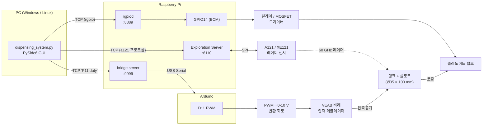

# Acconeer A121 레이더 기반 정밀 유체 토출 제어 시스템

> 60 GHz 펄스 코히어런트 레이더(Acconeer A121)로 탱크 수위를 비접촉 측정하고,
> 측정된 수위를 바탕으로 공압 레귤레이터 + 솔레노이드 밸브를 제어해
> **소량(0.6 ml ± 0.1 ml)의 유체를 정밀 토출**하는 시스템입니다.

| 항목 | 내용 |
|---|---|
| 개발 기간 | 2025.08 ~ 2025.10 |
| 언어 / 프레임워크 | Python 3.10, PySide6, PyQtGraph, NumPy |
| 센서 | Acconeer A121 (XE121 평가 모듈), Exploration Tool v7.17 |
| 제어 하드웨어 | Raspberry Pi (rgpiod), Arduino (PWM), VEAB 비례 압력 레귤레이터, 솔레노이드 밸브 |
| 실행 파일 | `dispensing_system.py` |

---

## 목차

1. [프로젝트 개요](#1-프로젝트-개요)
2. [시스템 구성 및 배선](#2-시스템-구성-및-배선)
3. [통신 구조](#3-통신-구조)
4. [수위 측정 원리와 신호처리](#4-수위-측정-원리와-신호처리)
5. [토출 제어 로직](#5-토출-제어-로직)
6. [설치 및 실행 방법](#6-설치-및-실행-방법)
7. [저장소 구조](#7-저장소-구조)
8. [개발 과정과 삽질 기록](#8-개발-과정과-삽질-기록)
9. [실험 로그](#9-실험-로그)
10. [알려진 이슈 / 남은 과제](#10-알려진-이슈--남은-과제)
11. [참고 자료](#11-참고-자료)

---

## 1. 프로젝트 개요

주사기형 소형 탱크(높이 100 mm, 지름 35 mm)에 담긴 유체의 수위를 레이더로 실시간 측정하고,
"목표량 N ml 토출" 명령을 받으면 **압력을 걸고 → 밸브를 계산된 시간만큼 열고 → 닫는** 방식으로 유체를 밀어내는 장치입니다.

핵심 아이디어는 다음 세 가지입니다.

- **비접촉 수위 측정** — 초음파·정전용량 센서와 달리 레이더는 유체 종류·용기 재질의 영향을 덜 받고, 밀폐 용기 위에서도 동작합니다. 수면 위에 띄운 플로트(반사판)를 표적으로 잡아 mm 단위 거리를 얻습니다.
- **공압 토출** — 펌프 대신 탱크 상부에 압력을 가해 유체를 밀어냅니다. 압력(kPa)과 밸브 열림 시간(s)만으로 토출량을 결정하므로 구조가 단순합니다.
- **수위 연동 보정** — 수위가 낮아질수록 같은 압력에서 유량이 줄어드는 것을 보상하기 위해 밸브 열림 시간에 수위 보정 계수를 곱하고, 적응 모드에서는 압력 자체도 수위에 따라 올립니다.

GUI 한 화면에서 센서 연결, 압력 모드 선택, 토출 실행, 실시간 수위 그래프, 토출 이력(합/불 판정)을 모두 처리합니다.

---

## 2. 시스템 구성 및 배선

### 2.1 전체 구성도



### 2.2 부품 목록

| 구분 | 부품 | 역할 |
|---|---|---|
| 센서 | Acconeer **A121** + **XE121** 평가 모듈 | 60 GHz PCR 레이더, 플로트까지의 거리 측정 |
| 컴퓨팅 | Raspberry Pi (3.3 V GPIO) | Exploration Server · rgpiod · Arduino 브리지 서버 실행 |
| 컴퓨팅 | Arduino | 압력 레귤레이터용 PWM 출력 (D11) |
| 공압 | Festo **VEAB-L-26-D2-Q4-V1-1R1** 비례 압력 레귤레이터 | 0-10 V 제어 신호에 비례해 출력 압력 조절 (0-200 kPa 범위로 사용) |
| 공압 | 솔레노이드 밸브 | 토출 라인 개폐 |
| 구동 | 릴레이 / MOSFET 모듈 | GPIO 3.3 V 로직으로 솔레노이드 코일 구동 |
| 구동 | PWM → 0-10 V 변환 회로 | Arduino 5 V PWM을 VEAB 제어 전압으로 변환 |
| 기구 | 투명 원통 탱크 (높이 100 mm, 내경 35 mm) + 플로트 | 유체 저장, 레이더 반사 표적 |

### 2.3 배선 / 핀 배치

| 신호 | 위치 | 코드 상 상수 | 비고 |
|---|---|---|---|
| 솔레노이드 ON/OFF | Raspberry Pi **GPIO14 (BCM)** | `SOLENOID_PIN_BCM = 14` | HIGH = 열림, LOW = 닫힘. 드라이버를 거쳐 코일 구동 |
| 압력 레귤레이터 PWM | Arduino **D11** | `REGULATOR_ARDUINO_PIN = 11` | duty 0-100 % → 0-200 kPa 선형 매핑 |
| A121 센서 | Raspberry Pi SPI (XE121) | – | Exploration Server가 직접 제어 |
| 센서 장착 위치 | 탱크 상단에서 **50 mm** 위 | `sensor_offset_mm = 50.0` | 센서 → 탱크 바닥 = 150 mm |
| 플로트 잠김 깊이 | – | `float_submersion_mm = 5.0` | 플로트 상면과 실제 수면의 차이 |

> **왜 Raspberry Pi에서 직접 PWM을 내지 않았나?**
> Pi의 PWM은 3.3 V 로직이라 VEAB의 0-10 V 입력을 바로 구동할 수 없습니다.
> 전압 레벨이 맞지 않아 Arduino의 하드웨어 PWM(D11)을 쓰고, Pi는 솔레노이드 GPIO와 브리지 서버만 담당하도록 역할을 분리했습니다. (→ [8장](#8-개발-과정과-삽질-기록))

---

## 3. 통신 구조

PC의 GUI는 Raspberry Pi와 **세 개의 독립된 TCP 채널**로 통신합니다. 하나가 끊겨도 나머지는 영향을 받지 않습니다.

| 채널 | 포트 | 프로토콜 | 용도 | 코드 위치 |
|---|---|---|---|---|
| 센서 | 6110 | Acconeer Exploration 프로토콜 (`a121.Client.open(ip_address, tcp_port)`) | 레이더 프레임 수신, 거리 검출 | `SensorThread` |
| GPIO | 8889 | **rgpio** (lgpio의 원격 데몬 `rgpiod`) | GPIO14 출력 제어 (솔레노이드) | `_init_rgpio_backend`, `gpio_write` |
| Arduino 브리지 | 9999 | 평문 텍스트 라인 | Arduino PWM 명령 전달 | `_send_arduino_command` |

### Arduino 브리지 명령 형식

```
P<핀번호>,<duty%>\n      예) P11,25.00\n   → D11에 duty 25 % PWM 출력
```

- Raspberry Pi의 브리지 서버가 9999 포트로 받은 라인을 그대로 Arduino 시리얼로 넘깁니다.
- 연결이 끊기면 `_send_arduino_command()`가 소켓을 닫고 한 번 재접속해서 재전송합니다.
- 접속 대상은 환경변수로 바꿀 수 있습니다: `RGPIO_HOST`, `RGPIO_PORT` (기본 `192.168.28.227:8889`).

---

## 4. 수위 측정 원리와 신호처리

### 4.1 레이더 거리 → 수위 → 부피

센서는 탱크 위쪽에 고정되어 **플로트 상면까지의 거리 d**를 측정합니다. 수위 h와 부피 V는 다음과 같이 계산합니다.

```
sensor_height = tank_height + sensor_offset          = 100 + 50 = 150 mm
h  = sensor_height − d − float_submersion           (mm, 0 ~ tank_height 로 클리핑)
V  = π · (D/2)² · h / 1000                           (ml,  D = 35 mm → 962.1 mm² · h / 1000)
```

예를 들어 d = 85 mm 이면 h = 150 − 85 − 5 = 60 mm, V ≈ 57.7 ml 입니다.

### 4.2 A121 Distance Detector 설정

Acconeer Exploration Tool의 `distance.Detector`를 그대로 사용하고, 파라미터만 소형 탱크에 맞췄습니다.

| 파라미터 | 값 | 이유 |
|---|---|---|
| `start_m` / `end_m` | 0.05 / 0.15 m | 센서 오프셋 ~ 탱크 바닥까지만 탐색 |
| `max_profile` | `PROFILE_1` | 가장 짧은 펄스 → 근거리 분해능 최우선 |
| `max_step_length` | 2 | 촘촘한 거리 샘플링 |
| `threshold_method` | `CFAR` | 배경 잡음에 적응하는 문턱값 |
| `threshold_sensitivity` | 0.5 | 플로트 반사가 강해 중간값으로 충분 |
| `reflector_shape` | `PLANAR` | 플로트 상면 = 평면 반사체 |
| `close_range_leakage_cancellation` | False | 50 mm 이상이라 근접 누설 보정 불필요 (켜면 캘리브레이션 시간이 늘어남) |
| `update_rate` | 20 Hz | GUI 갱신 주기와 균형 |

연결 직후 `calibrate_detector()`로 배경 캘리브레이션을 한 번 수행합니다.

### 4.3 필터 파이프라인

Detector가 내놓는 첫 번째 거리값(`res.distances[0]`)을 아래 순서로 정제합니다.

```
raw d ──▶ ① 범위 게이트 ──▶ ② 중앙값 필터 ──▶ ③ IQR 이상치 판정 ──▶ ④ EMA ──▶ filtered d
```

| 단계 | 내용 | 코드 |
|---|---|---|
| ① 범위 게이트 | `sensor_offset − 10 mm` ~ `sensor_offset + tank_height + 10 mm` 밖의 값은 버림 | `if distance_mm < ... or > ...: continue` |
| ② 중앙값 필터 | 최근 7개 샘플의 중앙값 (5개 이상 모이면 동작) | `np.median(distance_buffer)`, `median_window_size = 7` |
| ③ IQR 이상치 판정 | 중앙값이 `[Q1 − 1.5·IQR, Q3 + 1.5·IQR]`를 벗어나면 **이전 EMA 값으로 대체** | `q1, q3 = np.percentile(..., 25/75)` |
| ④ EMA | `ema = α·x + (1−α)·ema`, α = 0.2 | `ema_alpha = 0.2` |

EMA 수식: `y[n] = 0.2 · x[n] + 0.8 · y[n−1]` → 약 5샘플(0.25 s) 시정수로 잔떨림을 눌러 줍니다.

---

## 5. 토출 제어 로직

### 5.1 압력 모드

| 모드 | 목표 압력 | 용도 |
|---|---|---|
| 고정 (FIXED) | 50 kPa (GUI에서 변경 가능) | 기본 실험 조건 |
| 수동 (MANUAL) | 사용자가 입력한 kPa | 압력-유량 특성 측정 |
| 적응 (ADAPTIVE) | `100 kPa + 50 kPa × (1 − h/H)` | 수위가 낮을수록 압력을 올려 유량 유지 |

압력 → PWM duty 변환은 선형입니다.

```
duty(%) = (P − P_min) / (P_max − P_min) × 100      (P_min = 0, P_max = 200 kPa)
예) 50 kPa → duty 25 %  → Arduino로 "P11,25.00" 전송
```

### 5.2 밸브 열림 시간 계산

```
flow      = flow_coefficient × P            = 0.000042 × 50000 = 2.1 ml/s
base_time = target_internal / flow
h_factor  = 1 + height_time_gain × (1 − h/H)   (height_time_gain = 0.25)
deadtime  = (valve_lead_ms + valve_trail_ms) / 1000 = 0.09 s
open_time = ( max(base_time × h_factor, min_pulse) + deadtime ) × time_correction_gain
```

| 파라미터 | 기본값 | 의미 |
|---|---|---|
| `flow_coefficient` | 0.000042 ml/s/Pa | 압력-유량 비례 상수 (실측 기반) |
| `height_time_gain` | 0.25 | 탱크가 빌수록 최대 +25 % 더 오래 엶 |
| `valve_lead_ms` / `valve_trail_ms` | 60 / 30 ms | 밸브 기계적 응답 지연 |
| `min_pulse_ms` | 80 ms | 이보다 짧은 펄스는 밸브가 실제로 안 열림 |
| `precharge_ms` | 100 ms | 밸브 열기 전 압력을 먼저 걸어두는 시간 |
| `time_correction_gain` | **8.9** | 현장 오차 보정 (이론 0.63 s → 실측 5.6 s 필요) — 배관 누설, 진공 미형성 등 반영. GUI에서 실시간 조정 가능 |
| `target_mapping_ratio` | **0.60** | 사용자 목표량 → 내부 목표량 환산 (`0.6 ml 입력 → 내부 1.0 ml`) |

**수치 예시** (고정 50 kPa, 수위 70 mm, 목표 0.60 ml):

```
target_internal = 0.60 / 0.60 = 1.0 ml
base_time = 1.0 / 2.1 = 0.476 s
h_factor  = 1 + 0.25 × (1 − 0.70) = 1.075
open_time = (max(0.476 × 1.075, 0.08) + 0.09) × 8.9 ≈ 5.36 s
```

### 5.3 토출 시퀀스

```
1. regulator.set_pressure(P)        # Arduino → 레귤레이터에 압력 명령
2. sleep(precharge 100 ms)          # 압력 안정화
3. GPIO14 = HIGH  (open_valve)      # 솔레노이드 열림
4. sleep(open_time)                 # 계산된 시간 유지 (별도 QThread라 GUI는 안 멈춤)
5. GPIO14 = LOW   (close_valve)     # 닫힘
6. estimated_ml = flow × actual_time / time_correction_gain
7. |estimated − target| ≤ tolerance ? 합격 : 불합격  → 이력 테이블 + CSV
```

프로그램 종료(`closeEvent`) 시에도 밸브 닫기 → 레귤레이터 duty 0 → GPIO 해제 순으로 정리해 **항상 닫힌 상태로 끝나도록** 했습니다.

---

## 6. 설치 및 실행 방법

### 6.1 Raspberry Pi 쪽 (한 번만 설정)

```bash
# 1) Acconeer Exploration Server (XE121 → SPI)
#    https://developer.acconeer.com 에서 Raspberry Pi용 acc_exploration_server_a121 다운로드
./acc_exploration_server_a121          # 기본 포트 6110

# 2) lgpio / rgpiod  (원격 GPIO 데몬)
git clone https://github.com/joan2937/lg.git && cd lg
make && sudo make install
sudo rgpiod -p 8889 &                  # 8889 포트에서 대기

# 3) Arduino 브리지 서버 (9999 포트로 받은 라인을 Arduino 시리얼로 전달)
#    별도 스크립트 — 3장의 명령 형식을 그대로 릴레이하면 됩니다.
```

Arduino에는 시리얼로 `P<pin>,<duty>` 라인을 받아 `analogWrite(pin, duty × 2.55)`를 수행하는 스케치를 올립니다.

### 6.2 PC 쪽

```bash
git clone <this-repo>
cd Acconeer
python -m venv venv
venv\Scripts\activate            # Windows  (Linux: source venv/bin/activate)
pip install -r requirements.txt

# rgpio 파이썬 모듈은 lg 저장소에서 설치
git clone https://github.com/joan2937/lg.git
pip install ./lg/PY_RGPIO

# (선택) Pi 주소가 다르면
set RGPIO_HOST=192.168.x.x        # Linux: export RGPIO_HOST=...
set RGPIO_PORT=8889

python dispensing_system.py
```

### 6.3 GUI 사용 순서

1. **센서 연결** — Pi의 IP와 포트(6110) 입력 → `연결`. 로그에 "캘리브레이션 완료 / 시스템 준비 완료"가 뜨면 우측 그래프에 수위가 흐릅니다.
2. **토출 제어** — 목표량(ml), 허용 오차(±ml), 압력 모드, (수동이면) 압력 kPa, 시간 보정(×)을 설정합니다.
3. `토출 시작` — 예상 유량·예상 시간을 확인하고 실행. 완료되면 **토출 이력** 표에 합/불 판정과 함께 기록됩니다.
4. 창을 닫으면 이력이 `dispense_log_YYYYMMDD_HHMMSS.csv`로 저장됩니다.

### 6.4 솔레노이드 단독 테스트

```bash
python testing.py      # Pi GPIO14를 1초 HIGH → LOW (배선 확인용)
```

---

## 7. 저장소 구조

```
Acconeer/
├── dispensing_system.py        # 메인 프로그램 (GUI + 센서 + 토출 제어)
├── testing.py                  # 솔레노이드 GPIO 단독 테스트
├── requirements.txt
├── logs/                       # 실험 토출 로그 (2025-10-10 ~ 10-11)
│   └── dispense_log_*.csv
├── legacy/
│   └── tank_level_monitor.py   # 초기 버전: 수위 모니터링 전용 GUI (게이지·탱크 시각화)
└── .gitignore                  # venv, 외부 라이브러리 클론(acconeer-python-exploration, lg) 제외
```

외부 의존성은 저장소에 포함하지 않습니다.

- [acconeer-python-exploration](https://github.com/acconeer/acconeer-python-exploration) v7.17 — `pip install acconeer-exptool`
- [lg (lgpio / rgpio)](https://github.com/joan2937/lg) — Pi에는 `rgpiod`, PC에는 `rgpio` 파이썬 모듈

---

## 8. 개발 과정과 삽질 기록

### 8.1 1단계 — 수위 모니터 (`legacy/tank_level_monitor.py`)

처음에는 토출 없이 **레이더로 수위를 얼마나 안정적으로 읽을 수 있는가**만 확인했습니다.
지름 5 cm × 길이 15 cm 주사기 탱크를 대상으로, 원형 게이지 · 탱크 단면 애니메이션 · 실시간 플롯 · FPS 표시까지 넣은 "Professional Edition" GUI였습니다.

- SPI 직결과 TCP 두 가지 연결 방식을 모두 지원했습니다.
- Detector는 `PROFILE_1`, `CFAR`, `GENERIC` 반사체, 50 Hz로 설정했고, 중앙값 필터 크기를 GUI에서 조절하게 했습니다.

**배운 점**: 그래프가 세 개나 돌아가니 CPU 부하가 커서 프레임이 뚝뚝 끊겼습니다. 이후 버전에서는 수위 그래프 하나만 남기고 나머지를 전부 걷어냈고, 그것만으로 부하가 크게 줄었습니다.

### 8.2 "CSV는 잘 쌓이는데 그래프가 안 그려진다"

PyQtGraph 플롯이 빈 화면으로 나오는 문제를 한동안 붙잡았습니다.
데이터 파이프라인(CSV 로깅)이 정상인 걸 먼저 확인해 **문제를 GUI 렌더링 쪽으로 좁힌 뒤**, curve 초기화 시점과 `setData()` 호출 위치를 고쳐 해결했습니다.
이때부터 "데이터 → 로그 → 시각화" 순으로 한 단계씩 검증하는 습관이 생겼습니다.

### 8.3 필터를 복잡하게 만들었다가 되돌린 이야기

레이더 값이 튀는 걸 잡으려고 IQR 이상치 제거 + 다단 필터 + 칼만 필터까지 겹겹이 쌓아 봤습니다.
결과는 오히려 **값이 얼어붙어서(freeze) 수위가 변해도 따라오지 않는** 현상이었습니다. 이상치 판정이 너무 공격적이면 정상적인 수위 변화까지 이상치로 버려 버립니다.
최종적으로는 *범위 게이트 → 중앙값(7) → 가벼운 IQR 판정 → EMA(0.2)* 로 단순화했고, 이게 가장 잘 동작했습니다.

### 8.4 센서 높이 계산 실수

초기 코드는 `h = L − (d − sensor_distance)` 형태로 플로트 잠김 깊이를 고려하지 않았고, 센서 오프셋 값이 조금만 틀려도 수위 전체가 평행이동하는 문제가 있었습니다.
탱크 바닥 기준으로 `h = (tank_height + sensor_offset) − d − float_submersion` 으로 다시 세우고, 플로트가 잠기는 깊이(5 mm)를 따로 빼 주도록 수정했습니다. 오프셋은 빈 탱크에서 바닥까지의 거리를 실측해 맞췄습니다.

### 8.5 Acconeer 라이브러리 버전 문제

Exploration Tool 버전이 올라가면서 `DetectorResult`의 필드 구조와 `Detector.get_next()`의 반환 형식(센서 ID 딕셔너리 vs 단일 객체)이 달라졌습니다.
`result[1] if isinstance(result, dict) and 1 in result else result` 처럼 두 형식을 모두 받도록 방어 코드를 넣었고, `distances`/`strengths`가 `None`인 경우도 걸러냅니다.

### 8.6 3.3 V PWM으로 0-10 V 레귤레이터를 못 움직인다

Raspberry Pi GPIO PWM으로 VEAB를 바로 제어하려 했지만 전압 레벨이 맞지 않았습니다.
Pi 쪽은 `rgpiod`로 솔레노이드만 담당하게 하고, PWM은 Arduino D11로 옮긴 뒤 Pi에 소켓 브리지 서버(9999)를 두어 `P11,duty` 문자열을 시리얼로 넘기는 구조로 바꿨습니다.
코드의 `gpio_pwm_*` 함수들이 GPIO API 모양을 유지한 채 내부에서 소켓 명령을 보내는 이유가 이것입니다.

### 8.7 이론값 0.63 s vs 실측 5.6 s — `time_correction_gain`

압력-유량 모델(`flow = 0.000042 × P`)로 계산한 밸브 열림 시간은 0.6 ml 기준 약 0.63 s였는데, 실제로는 **5.6 s**를 열어야 비슷한 양이 나왔습니다.
배관 누설, 탱크 상부에 압력이 온전히 형성되지 않는 문제, 밸브 응답 지연이 겹친 결과로 판단했고, 모델을 다시 짜는 대신 **보정 계수 8.9**를 도입해 GUI에서 실시간으로 튜닝할 수 있게 했습니다.
같은 맥락에서 사용자 목표량과 내부 목표량의 비율(`target_mapping_ratio = 0.6`)도 실측으로 정했습니다.

---

## 9. 실험 로그

`logs/` 폴더에는 2025-10-10 ~ 10-11 사이 진행한 25회 세션의 토출 이력이 CSV로 들어 있습니다.

| 컬럼 | 의미 |
|---|---|
| `timestamp` | 저장 시각 (ISO 8601) |
| `target_ml` / `tolerance_ml` | 사용자 목표량 / 허용 오차 |
| `estimated_ml` | 유량 × 실제 열림 시간 / 보정계수 로 추정한 토출량 |
| `pressure_pa` | 적용 압력 (Pa) |
| `flow_rate` | 사용한 유량 모델 값 (ml/s) |
| `height_mm` | 토출 시점 수위 |
| `time_s` | 실제 밸브 열림 시간 |
| `pass` | `abs(estimated − target) ≤ tolerance` |

대부분 고정 50 kPa, 목표 0.60 ± 0.10 ml 조건이며, 수위 50 ~ 70 mm 구간에서 열림 시간 5.4 ~ 5.6 s가 기록되어 있습니다.

---

## 10. 알려진 이슈 / 남은 과제

- **추정량 판정 기준 불일치** — `estimated_ml`은 내부 목표(사용자 목표 ÷ 0.6)를 기준으로 계산되는데, 합/불 판정은 사용자 목표와 비교합니다. 이 때문에 로그의 `estimated_ml`이 1.27 ~ 1.33 ml로 나오며 항상 불합격으로 기록됩니다. 판정 기준을 통일해야 합니다.
- **개루프 제어** — 현재는 시간 기반 개루프입니다. 토출 전후의 레이더 수위 차(Δh → ΔV)를 실제 토출량으로 쓰면 보정 계수 없이 폐루프 제어가 가능합니다.
- **PWM → 0-10 V 변환** — Arduino PWM + RC 필터 대신 I2C DAC(예: MCP4725) + OP-AMP 증폭이 더 안정적일 것으로 보입니다.
- **브리지 서버 / Arduino 스케치** — Raspberry Pi 쪽 브리지 스크립트와 Arduino 스케치는 이 저장소에 아직 포함되어 있지 않습니다.

---

## 11. 참고 자료

- Acconeer A121 문서: https://docs.acconeer.com/en/latest/
- Acconeer Python Exploration Tool: https://github.com/acconeer/acconeer-python-exploration
- Distance Detector 알고리즘 설명: https://docs.acconeer.com/en/latest/detectors/a121/distance_detection.html
- lg (lgpio / rgpio) 라이브러리: https://github.com/joan2937/lg
- Festo VEAB 비례 압력 레귤레이터 데이터시트 (VEAB-L-26-D2-Q4-V1-1R1)
- PySide6: https://doc.qt.io/qtforpython-6/ · PyQtGraph: https://pyqtgraph.readthedocs.io/
